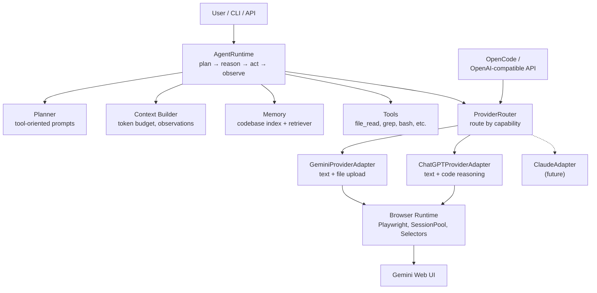

# SubscriptionBridge

**A local personal agent runtime that turns browser-based consumer LLM subscriptions into agent-capable inference backends.**

[](https://www.python.org/)
[](https://opensource.org/licenses/MIT)

---

## Problem

You already pay for Gemini, ChatGPT, or Claude through your browser. But you cannot use them as programmable agents. They are locked inside web UIs. Official APIs cost extra, have different models, have separate rate limits, and often require billing setup.

**SubscriptionBridge solves this** by wrapping your existing browser-based subscriptions behind a local API. It can act as either an OpenAI-compatible model gateway for external agents, or as its own native local coding agent.

## Core Value Proposition

> **The browser LLM is NOT the agent. The local runtime is the agent. The browser UI is only a provider/inference backend.**

- Use your existing Gemini/ChatGPT/Claude subscriptions as inference backends
- No API keys required — just your browser session
- Full agent loop with tools (file read/write, grep, bash, git diff, patch)
- Codebase memory indexing with semantic, keyword, and symbol search
- File prompting (upload files to Gemini alongside prompts)
- OpenAI-compatible `/v1` model gateway for OpenCode and other clients
- Native `/agent/runs` and `/run` agent APIs with local tool execution
- Modular provider architecture — add new providers without changing the runtime

---

## Architecture



### Six Layers

| Layer | Component | Responsibility |
|-------|-----------|----------------|
| 1 | CLI / API | User entry point (Typer CLI + FastAPI) |
| 2 | Agent Runtime | Loop: plan → reason → act → observe |
| 3 | Context Builder | Builds prompts with token budget control |
| 4 | Provider Layer | Standard interface for browser LLMs |
| 5 | Browser Runtime | Playwright lifecycle, tab sessions, selector safety |
| 6 | Tools & Memory | File ops, grep, bash, codebase indexing |

---

## Quick Start

```bash
# Install
pip install -e ".[dev]"

# Verify installation
bridge --help
bridge provider list

# Try the fake provider (no browser needed)
bridge ask "Hello, world!" --provider fake
bridge run "Read README.md and summarize it" --provider fake -w .

# Codebase memory
bridge codebase index .
bridge codebase search "provider adapter" -w . -k 5
bridge codebase stats -w .

# Run tests
pytest tests/ -v
```

---

## Setup Browser for Gemini

### CDP Mode (only way that works)

```bash
google-chrome \
  --remote-debugging-port=9333 \
  --user-data-dir="$HOME/.subscription-bridge/chrome-profile" \
  --no-first-run \
  --no-default-browser-check
```

Then navigate to https://gemini.google.com/app and log in **once**. Login persists in the profile.

### One-command startup script

```bash
chmod +x ~/start.sh
~/start.sh
```

This starts Chrome + the bridge server. Then open OpenCode Desktop and select a Gemini model.

---

## Setup Browser for ChatGPT

### CDP Mode

```bash
google-chrome \
  --remote-debugging-port=9333 \
  --user-data-dir="$HOME/.subscription-bridge/chrome-profile" \
  --no-first-run \
  --no-default-browser-check
```

Then navigate to https://chatgpt.com and log in **once**. Login persists in the profile.

### Start with ChatGPT

```bash
bridge server --provider chatgpt
```

Or let the server prompt you:

```bash
bridge server
# ? Which provider do you want to use?
#   1) Gemini
#   2) ChatGPT
#   3) Both
```

In OpenCode, select the `subscription-bridge-chatgpt` model.

### Verify

```bash
curl http://127.0.0.1:8787/health
curl http://127.0.0.1:8787/v1/models
```

---

## OpenAI-Compatible Endpoints

SubscriptionBridge exposes an OpenAI-compatible `/v1` API for integration with [OpenCode](https://opencode.ai) and other OpenAI-compatible clients.

This API is a model gateway only. `/v1/chat/completions` forwards prompts to the selected browser model and may return OpenAI-compatible `tool_calls`, but it does not execute local tools. Clients such as OpenCode own project context, file edits, shell commands, and tool result submission.

```bash
# List models
curl http://127.0.0.1:8787/v1/models

# Chat completion
curl -X POST http://127.0.0.1:8787/v1/chat/completions \
  -H "Content-Type: application/json" \
  -H "Authorization: Bearer dummy" \
  -d '{
    "model": "subscription-bridge-fake",
    "messages": [{"role": "user", "content": "Hello"}],
    "stream": false
  }'

# Streaming
curl -N -X POST http://127.0.0.1:8787/v1/chat/completions \
  -H "Content-Type: application/json" \
  -H "Authorization: Bearer dummy" \
  -d '{
    "model": "subscription-bridge-fake",
    "messages": [{"role": "user", "content": "Greet me"}],
    "stream": true
  }'
```

Available models:

| Model ID | Backend | Context | Output | Requires Browser |
|----------|---------|---------|--------|-----------------|
| `subscription-bridge-fake` | FakeProviderAdapter | 32K | 8K | No |
| `subscription-bridge-gemini-fast` | Gemini 3 Flash | 1M | 8K | Yes |
| `subscription-bridge-gemini-thinking` | Gemini 3 Deep Think | 192K | 64K | Yes |
| `subscription-bridge-gemini-pro` | Gemini 3.1 Pro | 1M | 64K | Yes |
| `subscription-bridge-chatgpt` | ChatGPT (GPT-4o) | 128K | 16K | Yes |

### File / Image Upload

Attach files (including images) alongside your prompt — Gemini processes them natively:

```bash
# Describe an image
bridge ask "What's in this image?" --provider gemini --file photo.jpg

# Analyze a document
bridge ask "Summarize this" --provider gemini --file report.pdf

# Multiple files
bridge ask "Compare these images" --provider gemini --file img1.png --file img2.png

# Via API
curl -X POST http://127.0.0.1:8787/ask \
  -H "Content-Type: application/json" \
  -d '{"provider":"gemini","prompt":"Describe this","files":["/path/to/image.png"]}'
```

Upload uses CDP DOM injection to bypass the native OS file dialog — works with Chrome in CDP mode.

See [docs/opencode.md](docs/opencode.md) for OpenCode configuration.

## Native Agent API

Use `/agent/runs` when you want SubscriptionBridge itself to run the local agent loop and execute tools. The legacy `/run` endpoint remains available and delegates to the same native agent service.

```bash
curl -X POST http://127.0.0.1:8787/agent/runs \
  -H "Content-Type: application/json" \
  -d '{
    "provider": "fake",
    "task": "Read README.md and summarize it",
    "workspace": ".",
    "max_steps": 5
  }'
```

Use `/v1/chat/completions` for external agents. Use `/agent/runs` or `/run` for SubscriptionBridge-managed local tool execution.

## CLI Commands

| Command | Description | Status |
|---------|-------------|--------|
| `bridge ask <prompt>` | Send a prompt to a provider | ✅ Phase 1 |
| `bridge run <task>` | Run the agent tool loop | ✅ Phase 4 |
| `bridge server` | Start the local API server (prompts for provider) | ✅ Phase 7 |
| `bridge stop` | Stop the running server | ✅ |
| `bridge provider list` | List configured providers | ✅ Phase 1 |
| `bridge provider health <name>` | Check provider health | ✅ Phase 1+3 |
| `bridge session list` | Show active browser sessions | ✅ Phase 2 |
| `bridge session reset <id>` | Reset a browser session | ✅ Phase 2 |
| `bridge browser doctor` | Check browser environment | ✅ Phase 2 |
| `bridge codebase index <path>` | Index workspace for search | ✅ Phase 5 |
| `bridge codebase search <query>` | Search indexed codebase | ✅ Phase 5 |
| `bridge codebase stats` | Show index statistics | ✅ Phase 5 |

### File Prompting (Gemini)

```bash
bridge ask "Summarize this PDF" --provider gemini --file report.pdf
bridge ask "Compare these files" --provider gemini -f file1.pdf -f file2.docx
```

---

## Local API Server

```bash
bridge server --host 127.0.0.1 --port 8787
```

```bash
curl http://127.0.0.1:8787/health
curl -X POST http://127.0.0.1:8787/ask \
  -H "Content-Type: application/json" \
  -d '{"provider":"fake","prompt":"Say hello"}'
curl -X POST http://127.0.0.1:8787/codebase/search \
  -H "Content-Type: application/json" \
  -d '{"workspace":".","query":"provider adapter"}'
```

API docs: http://127.0.0.1:8787/docs

---

## Component Map

| Component | Location | Purpose |
|-----------|----------|---------|
| Typer CLI | `cli/app.py` | All `bridge` commands |
| FastAPI server | `api/server.py` | Local HTTP API |
| AgentRuntime | `core/agent_runtime.py` | Main run loop |
| Planner | `core/planner.py` | Builds tool-oriented prompts |
| ToolExecutor | `tools/executor.py` | Runs validated tool calls |
| Tools | `tools/*.py` | file_read, file_write, grep, bash, git_diff, patch, codebase_search |
| ProviderAdapter interface | `providers/base.py` | Abstract provider contract |
| FakeProviderAdapter | `providers/fake.py` | Deterministic test provider |
| GeminiProviderAdapter | `providers/gemini/adapter.py` | Gemini text + file prompting |
| ChatGPTProviderAdapter | `providers/chatgpt/adapter.py` | ChatGPT text + code reasoning |
| Prompt IO | `providers/gemini/prompt_io.py` | Prompt insertion with integrity check |
| Response Reader | `providers/gemini/response_reader.py` | Response extraction |
| Upload | `providers/gemini/upload.py` | File upload via Playwright |
| Attachment validation | `providers/gemini/attachments.py` | File type/size/sensitivity rules |
| PlaywrightManager | `browser/playwright_manager.py` | Browser lifecycle |
| SessionPool | `browser/session_pool.py` | Tab session management |
| SelectorRegistry | `browser/selector_registry.py` | YAML-based UI selectors |
| UIGuard | `browser/ui_guard.py` | Safe click and overlay helpers |
| JSON Parser | `parsing/json_parser.py` | Parse + repair agent actions |
| CodebaseIndexer | `memory/codebase_indexer.py` | Walk, chunk, embed, save |
| Retriever | `memory/retriever.py` | Semantic + keyword + symbol search |
| Security | `utils/security.py` | Secret redaction, URL sanitization |
| Retry | `utils/retry.py` | Decorator-based retry with backoff |
| Async utils | `utils/async_utils.py` | Timeout, concurrency-limited gather |
| Structured logging | `logging/logger.py` | structlog with JSON/console formats |
| Event constants | `logging/events.py` | run_started, tool_called, etc. |

---

## Safety Model

### File operations
- All file reads/writes are restricted to the workspace directory
- Path traversal (`../`) is rejected with `PathTraversalError`
- Maximum file size limits for both indexing and Gemini uploads

### Shell commands
- Dangerous commands (`rm -rf /`, `sudo`, `shutdown`, `mkfs`, etc.) are blocked by pattern matching
- Commands run with a timeout
- Output is redacted for secrets before logging

### File uploads (Gemini)
- Sensitive files blocked by default (`.env`, `id_rsa`, `.ssh/`, `.git/`)
- Archives optionally blockable
- Empty files optionally blockable
- Hidden files optionally blockable
- Unknown extensions are allowed — no arbitrary allowlist
- File contents are never logged or stored in metadata

### Logging
- All log output passes through `sanitize_for_log` before storage
- Cookies, tokens, passwords, and API keys are detected and redacted
- Browser storage, cookies, and credentials are never logged

---

## Limitations

- **Browser UI stability**: Provider web UIs can change their HTML structure, which may break CSS selectors. Selectors are centralized in YAML for easy updates, but this is inherently less reliable than a stable API.
- **Manual login required**: Each browser session requires manual login to the provider. There is no credential automation.
- **Rate limits still apply**: The provider's own rate limits are not bypassed. Throttling is the user's responsibility.
- **Slower than API calls**: Browser automation is inherently slower than direct API calls due to page loads, DOM waits, and UI interactions.
- **Hash embeddings**: The default embedding provider (hash-based) is deterministic and requires no model downloads, but is not as accurate as Sentence Transformers or other neural models.
- **Gemini and ChatGPT supported**: Both Gemini and ChatGPT are implemented as browser-based providers. Claude adapter is future work.
- **E2E tests require manual browser**: Real provider tests cannot run in CI without manual login.
- **Single-user**: The API server is designed for local use. No authentication, rate limiting, or multi-tenancy.

---

## Future Work

| Phase | Feature | Status |
|-------|---------|--------|
| ChatGPT provider adapter | ✅ Done |
| Claude provider adapter | ⬜ Planned |
| Stronger semantic embeddings (SentenceTransformer default) | ⬜ Planned |
| Tree-sitter syntax-aware chunking | ⬜ Planned |
| Provider UI self-healing selectors | ⬜ Planned |
| Streaming responses with true token streaming | ⬜ Planned |
| Web dashboard | ⬜ Planned |
| Plugin system for custom tools | ⬜ Planned |
| Optional Docker packaging | ⬜ Planned |

---

## Legal & Ethical

- **No bypassing**: This project does not bypass paywalls, login systems, captchas, anti-bot systems, or provider security measures.
- **No rate limit abuse**: The user is responsible for respecting provider rate limits.
- **No data scraping**: The project only interacts with the user's own sessions.
- **User-controlled**: All browser sessions are manually logged in by the user. No credentials are stored, automated, or transmitted.
- **Local only**: The API server binds to `127.0.0.1` by default and is not designed for remote access.
- **Personal automation**: This is a local personal runtime project. Use responsibly.

## License

MIT
